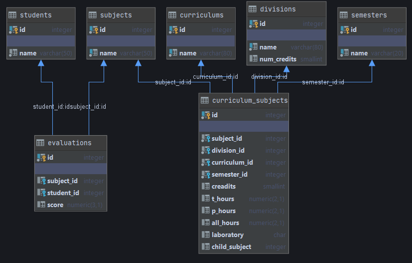

# Prueba-de-concepto

Reportes de calificaiones para la carrera de ingeniería aeroespacial 🚀

## Instalación

EL proyecto hace uso de [Slim 4](http://www.slimframework.com/docs/v4/)

### Requisitos

- Instalr [Docker](https://docs.docker.com/)

- Instalar PHP >= 7.2 y Composer

### Crear base de datos, el usuario es `pgdev` y la contraseña `developer`

```
$ docker run --name postgres-docker -e POSTGRES_PASSWORD=postgres -p 5432:5432 -d postgres
$ docker exec -it postgres-docker psql -U postgres -c "create role pgdev with login superuser password 'developer'"
```

El SQL de la base de datos v.1.0 esta dentro del directorio [/bd/aeroespacial.sql](/bd/aeroespacial.sql), el diagrama UML en el siguiente:



## Frontend

- [Tailwindcss](https://tailwindcss.com/): Responsivo, no impone un diseño predeterminado, ligero y no ocupa JQuery

- [VueJs](https://vuejs.org/): Moderno y basado en compoenentes

- [Axios](https://github.com/axios/axios): Facilita las llamadas asincronas

## Backend

- [Postgres](https://www.postgresql.org/)

- [Slim 4](http://www.slimframework.com/docs/v4/) Poderoso microframework de PHP
